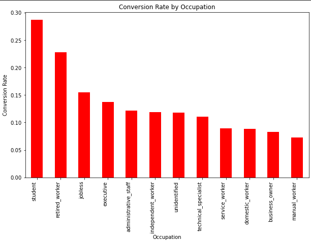
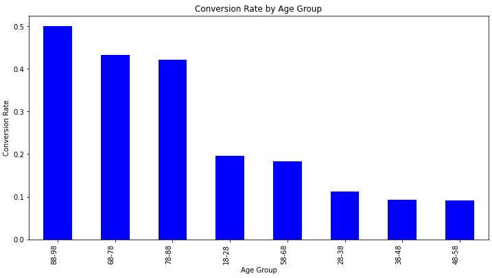
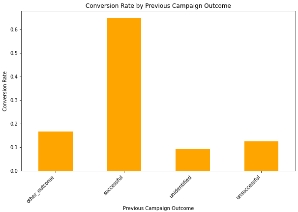

# Phase 3 Project

In this project description we will cover:

* [***Project Overview:***](#project-overview) the project goal, audience, and dataset
* [***Business Understanding:***]# understanding the business problem or opportunity that the project aims to address
* [***Data Understanding:***] gathering, exploring, and comprehending the data that will be used to solve the business problem
* [***Conclusion:***](#conclusion) brief summary of the findings and recommendations.

### Project Overview

For this project, I used exploratory data analysis to generate insights for a bank(business stakeholder).

### Business Understanding
Analyzing a bank's customer data to identify key segments that are most likely to convert to the bank's insurance products. By understanding which factors influence a customer's decision to subscribe to the insurance service, it is easier to develop targeted strategies to improve conversion rates, optimize marketing efforts, and ultimately increase revenue for the bank.

### Data Understanding
In this folder, `dataset` is a datasets from 
* [Kaggle](https://www.kaggle.com/)

* **Data Description.**

* ***Occupation*** The job category of the customer (e.g. student, retired, jobless)

* ***Age*** The age of the customer

* ***Education Level*** The education level of the customer

* ***Marital Status*** The marital status of the customer

* ***Communication Channel*** The channel through which the customer was contacted (e.g mobile, landline)

* ***Call Month*** The month in which the customer was called

* ***Call Day*** The day of the month the customer was contacted

* ***Call Duration*** The duration of the call with the customer

* ***Call Frequency*** The number of times the customer was contacted

* ***Previous Campaign Outcome*** The outcome of the previous campagin with the customer

* ***Conversion Status*** Whether the customer converted(purchased the insurance offered by the bank) or not

* **Exploratory Data Analysis.**
***Occupations with Highest and Lowest Conversion Rates:***
Identified which job categories have the highest and lowest likelihood of conversion.

* ***Age and Conversion Rate:*** Analyzed how different age groups impact the likelihood of conversion

* ***Impact of Previous Campaign Outcomes:***  Investigated how the outcome of past campaigns influences the current conversion rate.

### Modeling

In this project, I used classification modeling to predict which bank customers are most likely to convert to the bank's
insurance cover.

Since the data was heavily imbalanced, I had to use SMOTE (Synthetic Minority Over-sampling Technique).

 ***Overview*** : SMOTE is a technique used to address class imbalance in datasets by generating synthetic examples for the minority class. In the context of our project, SMOTE was applied to enhance the performance of the model by balancing the number of converted and non-converted cases.

***Purpose*** : Balancing the Dataset: By creating synthetic samples for the minority class (converted cases), SMOTE helps the model learn better from underrepresented classes, which can lead to improved performance metrics, especially in terms of recall and precision.

 ***Impact on Model Perfomance*** :

*Precision*: Improved by generating more balanced training data, leading to more accurate predictions for the minority class.

*Recall*: Slightly reduced compared to the baseline model, indicating a trade-off between capturing as many conversions as possible and maintaining precision.

*AUC-ROC*: Increased, reflecting better model performance in distinguishing between converted and non-converted customers.

***Considerations*** : While SMOTE helps in balancing the dataset and potentially improving certain metrics, it was important to balance this with the potential trade-offs in recall and this understanding helped me build my models.

I built three models in my project:
* ***Simple Baseline model:*** using logistic regression

* ***Tuned baseline model*** A version of the simple baseline model with tuned hyperparameters found using grid search

* ***Final Model*** A Random Forest classifier that had the best metrics of all the models

### Evaluation
These models were evaluated using metrics such as precision, recall and accuracy.

 
* ***Model Perfomance Metrics***

*Accuracy*: The percentage of correctly classified instances out of the total instances. For my models, I observed:
Baseline Model Accuracy: 90%
SMOTE-Augmented Final Model Accuracy: 93%

*Precision*: The proportion of positive identifications that were actually correct. This helps to understand how many of the predicted conversions were true positives.
Baseline Model Precision: 91%
SMOTE-Augmented Final Model Precision: 93%

*Recall*: The proportion of actual positives that were correctly identified. This metric is important for understanding how well the model captures all potential conversions.
Baseline Model Recall: 97%
SMOTE-Augmented Model Recall: 95%

*AUC-ROC*: The area under the Receiver Operating Characteristic curve, which measures the model's ability to distinguish between classes. A higher value indicates better performance.
Baseline Model AUC-ROC: 0.89
SMOTE-Augmented Model AUC-ROC: 0.99

* ***Trade-offs and Considerations***

*Accuracy vs. Recall*: The baseline model has a higher recall, meaning it identifies more true positive conversions, which might be crucial in a scenario where capturing all potential conversions is critical. However, the higher recall comes at the cost of lower precision and slightly lower accuracy.

*Precision vs. Recall*: The SMOTE-Augmented model improved precision but slightly reduced recall. This trade-off means that while the model is more accurate in predicting conversions, it misses some potential conversions.

*AUC-ROC*: The AUC-ROC for the SMOTE-Augmented model is higher, indicating better performance in distinguishing between converted and non-converted customers. This might be beneficial if the ability to discriminate between classes is a priority.

* ***Model Choice:***

The decision to use the SMOTE-Augmented Random Forest model was based on these trade-offs. Capturing as many conversions as possible is more important while at the same time, reducing the number of false positive predictions, therefore the final model proved to be more preferable over the baseline model.

### Conclusion
In this project, we analyzed customer data to identify key segments likely to convert to the bank's insurance products. Through Exploratory Data Analysis (EDA) and various modeling techniques, we gained insights into factors influencing conversion rates and evaluated model performance.

***Key Findings:***

*Occupation and Age Impact*: Certain occupations and older age groups showed higher conversion rates, indicating targeted marketing efforts might be more effective for these segments.

*Previous Campaign Success*: Customers who previously converted are more likely to convert again, suggesting a focus on nurturing these relationships could boost future conversions.

*Model Performance*: While the Random Forest model demonstrated high accuracy and AUC-ROC, indicating strong predictive power, trade-offs in recall and precision were noted. The use of SMOTE improved class balance but slightly affected recall.

*Recommendations*: Focus on high-conversion segments, leverage previous campaign successes, and consider model trade-offs based on business priorities. Further research and refinement of strategies may enhance overall effectiveness.